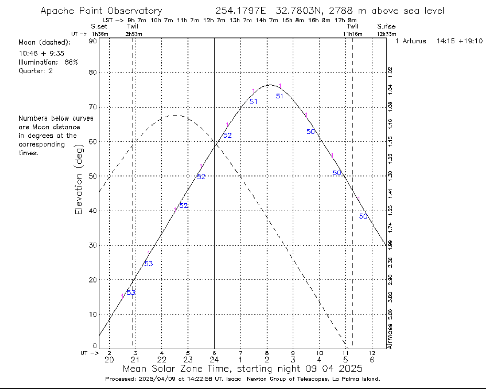

# Assignment 1: coordinate transformations and altitude plotting

In this assignment we will recreate a simple version of one of the most useful tools for planning observations: the "Staralt" or target altitude plot. These tools allow to plot the altitude of an object from its RA/Dec coordinates for a given observatory and night. An example is the [ING Staralt](https://astro.ing.iac.es/staralt/) but there are many similar ones. Here's an example of the output, for the star Arturus, observed from Apache Point Observatory for the night of April 9th, 2025:

{w="100%" align=center}

This image can be generated by using the line `Arturus 14 15 40 +19 10 56` and selecting Apache Point Observatory in the drop-down menu. The output is a plot of the altitude of the star as a function of time, with the x-axis representing time (in both local, UT, and sidereal times) and the y-axis representing the altitude of the star. Note that the altitude of the Moon is also displayed as a dashed line. The times of the sunset/sunrise and twilights are also marked. The blue numbers under the Arturus curve indicate the distance to the Moon in degrees. This plot tells us that at the beginning of the night Arturus will be very low, at ~20 degrees over the horizon, but will rise up to about 80 degrees at 8 UT.

## Assignment link

To start working on the assignment, accept [this invitation](https://classroom.github.com/a/KmBuoUO8) which will create a private repository from the base template.

## Goals and rubric

The goal of this assignment is to create a very simple version of the Staralt tool. In particular you need to:

- Complete the function `get_altitude()` in `src/staralt/staralt.py` to receive an Astropy [SkyCoord](https://docs.astropy.org/en/stable/api/astropy.coordinates.SkyCoord.html) object in RA/Dec coordinates and a date, and return the altitude of the object at Apache Point Observatory for that date, as a float.
- Complete the function `plot_altitude()` that must create a Staralt-like plot for a given object and an entire night. You can choose any object that you like but the object must be at least partially visible during the night that you are plotting (which you can also choose). The plot must also show the altitude of the Moon as a dashed line. `plot_altitude()` must ultimately call `get_altitude()` to get the altitude of each object at each time step, and it must write a file called `staralt.png` with the plot. The axes must be labelled and the x-axis must be in UT (Universal Time).

Here is the rubric for the assignment:

| Criteria                                                   |                                                            |                           Ratings                           |                                         | Points |
| ---------------------------------------------------------- | :--------------------------------------------------------: | :---------------------------------------------------------: | :-------------------------------------: | ------ |
| The code runs and passes the basic tests (green checkmark) |                _2 points_ The code runs                 |            _No points_ The code does not run             |                                         | 2      |
| The function `get_altitude()` is implemented correctly     |          _3 points_ Returns the correct value           |           _1 point_ Returns an incorrect value           | _No points_ Not implemented or fails | 3      |
| The function `plot_altitude()` is implemented correctly    |           _3 points_ Produces a correct plot            |           _1 point_ Produces an incorrect plot           | _No points_ Not implemented or fails | 5      |
| Extra credit                                               | _2 points_ Plot shows sunset and twilight times and LST | _1 point_ Plot shows either sunset/twilight times or LST |                                         | 2      |

## Deadline

The assignment is due on ~~Wednesday, April 16~~ Thursday, April 17 at 11:59 PM. Late submissions by up to 24 hours will be penalized by 20% of the total points.

## Hints and resources

- While you can use any library that you prefer, This assignment can be done using just [astropy](https://docs.astropy.org/en/stable/) and [matplotlib](https://matplotlib.org/stable/index.html). For `astropy` you will need the `coordinates` and `time` submodules.
- You can _not_ use any library that directly produces the Staralt plot, but you can use them (as well as [Staralt](https://astro.ing.iac.es/staralt/) or any other similar tool) to check your results.
- For coordinate transformations you can write the equatorial to horizontal transformation yourself or use the `astropy` method `transform_to()` with an [AltAz](https://docs.astropy.org/en/stable/api/astropy.coordinates.AltAz.html) frame. The latter is the recommended approach. If you write your own transformations you will still need to use `astropy` or a similar library to calculate the local sidereal time (LST) at each date step so that you can calculate the object hour angle.
- For the Moon position we recommend using the function [get_body](https://docs.astropy.org/en/latest/api/astropy.coordinates.get_body.html).
- An object representing the location of Apache Point Observatory can be generated using the `astropy` function `EarthLocation.of_site()` (see [Assignment 0](../assignment_0/assignment_0.md)).
- Do not worry too much about the aesthetics of the plot but make sure the axes are correctly labelled and that the values make sense.
- Be careful with the units of the angles! `astropy` will handle either hours or degrees for the RA but you must know which ones are passing. My advice is to use degrees for everything; remember that you can convert from hours to degrees by multiplying by 15.
- You can (and should!) create additional functions to make your code more readable and modular. For example, you can create a different function to get the altitude of the Moon, or to return a list with all the altitudes for each time step during the night.
- Do not commit any of the output files (e.g. `staralt.png`) to the repository. In fact the configuration of the repo (the `.gitignore` file) should be such that it ignores all files that are not source code.
- This assignment is individual. As a reminder you can work with other students but your code submission must be original and your own. Feel free to scout the Internet for ideas and documentation but please refrain from using AI chatbots.
