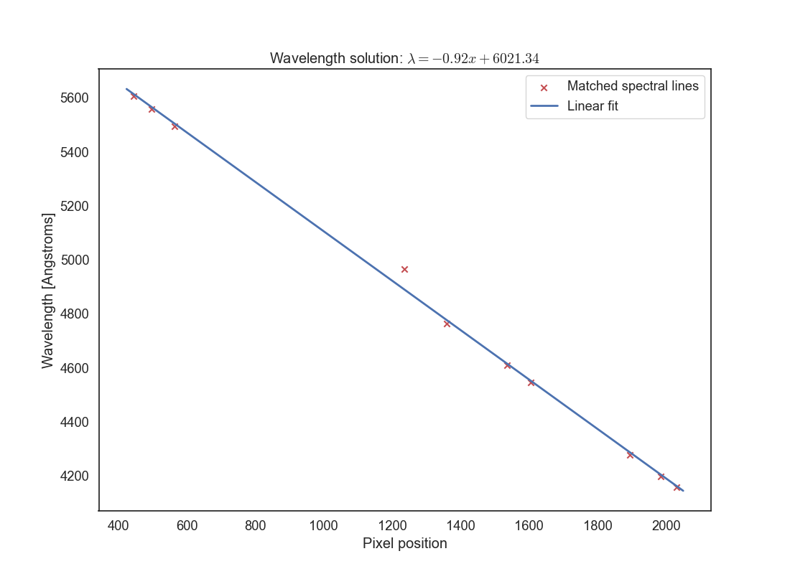
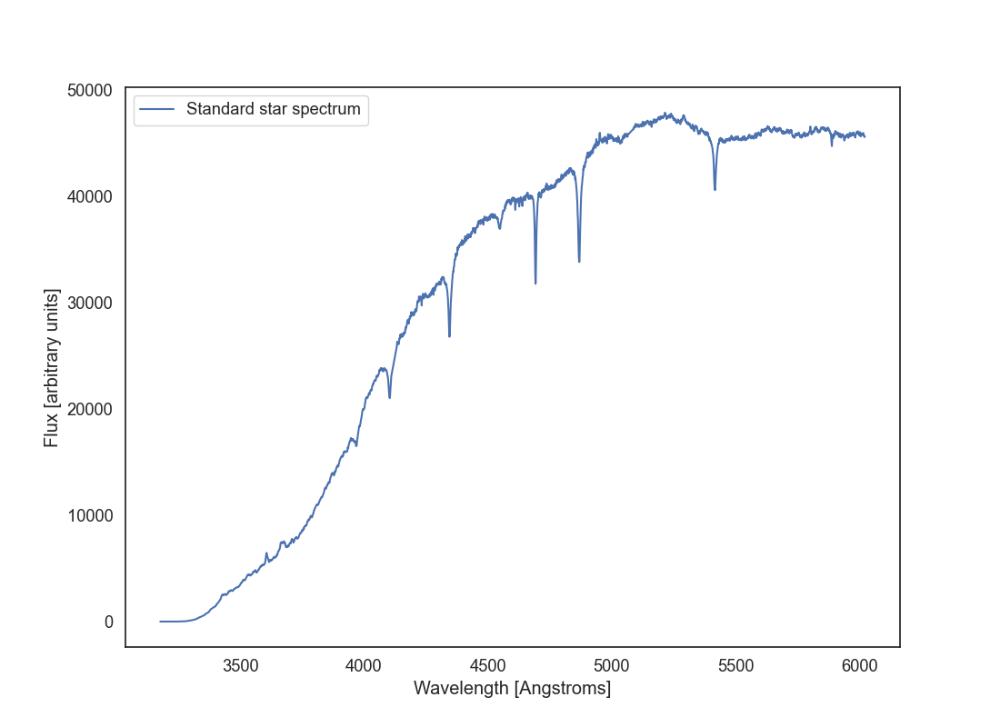

# Assignment 4 (extra credit): spectroscopic data reduction

In this optional assignment we perform a very basic data reduction of a long-slit spectroscopic observation.

## Assignment link

To start working on the assignment, accept [this invitation](https://classroom.github.com/a/Y4zh7OTB) which will create a private repository from the base template.

## Assignment description and grading

This assignment is a bit different from the previous ones. Instead of implementing a series of functions, you can implement you code in any way that you like as long as it produces the outputs described below. The tests will call the function `spec_reduction.spec.spec_reduction()` with the path to the data directory with the raw data. I encourage you to write your code as a series of functions and call them from the `spec_reduction()` function, but you are free to implement the code as you like.

The assignment will be graded with up to 15 points. **This is an extra credit assignment; it will not affect or penalise your grade if you do not attempt it.**

The following subsections describe the steps that you need to implement in your code and hints to do so. The expected outputs are highlighted in red.

## Dataset

The dataset for this assignment can be downloaded from [this link](https://faculty.washington.edu/gallegoj/astr480/spec_data.tar.bz2). The dataset includes a flat field frame, an arc, and a science observation of a star. The flat is already bias-subtracted and normalised, the arc is also ready to use; the science observation is bias subtracted but not flat corrected.

All the data was taken using the Gemini-GMOS long-slit spectrograph. The data was taken from [this](https://astro.dur.ac.uk/~knpv27/pg_dr_course/pg_dr_spectroscopy.html) course. You are welcome to read the description there and their lecture notes but note that the data reduction described there is more complex and they use [IRAF](https://iraf-community.github.io) to do the data reduction.

## Flat-correct the science observation and determine the aperture size

Start by having a look at the `b_std.fits` file (the science observation of the standard) using DS9 or plotting it in Python. Play with the stretch and intervals a bit. Which one is the wavelength direction and which one is the slit direction? Note that the image is taken by combining three CCD detectors and there are two small gaps between them.

The science image is bias subtracted so we only need to correct it for the flat field. To do this, you will need to divide the science image by the flat field image, which is already normalised (you can confirm this by taking a median or bias to the image).

Next we want to determine the aperture to use. Since this is an observation of a point source, we do not need the entire slit range, and doing so would add to the noise. Take a cut along the slit direction and use at least 50-100 columns along the wavelength direction (make sure you don't include the gaps between the CCDs). Collapse this 2D array using a mean and create a 1D vector along the slit direction. Plot the resulting vector. It should look like a Gaussian and should tell you the range of slit pixels to use for the extraction.

For extra-extra grade you can fit a 1D Gaussian to the resulting vector and determine the aperture size as 3 times the standard deviation of the Gaussian. Otherwise, you can determine the aperture size by eye. Save a plot with filename `aperture_size.png` that shows the 1D vector along the slit direction. If you have fit a Gaussian, overplot the Gaussian fit. Otherwise, use two vertical lines to indicate the aperture size that you will use.

{ w="80%" align="center" }

Now extract the aperture from the science image. Use the entire wavelength range but only the pixels in the slit direction that you determined above. Collapse the slit direction by taking a mean (you can use something more sophisticated like a sigma-clipped median if you want). Save the resulting 1D spectrum in a file called `b_std_aperture.fits`. You can create this file using `PrimaryHDU` as usual; the data will just be a 1D array.

## Wavelength calibration

Now we will switch to using the `arc.fits` file. This file contains the arc spectrum, which is a 2D image with the same dimensions as the science observation but in which the slit was illuminated with a lamp that produces a series of emission lines at known wavelengths. The arc spectrum is already bias subtracted and flat corrected.

Read the arc file and extract the same aperture as your did for the science image. Collapse it into a 1D spectrum as you did for the science observation. Plot the resulting spectrum as `arc_aperture.png` (use a line plot for this). You should see a series of peaks corresponding to the emission lines in the arc spectrum, but you will also notice that there is a significant continuum in the spectrum.

Let's measure and subtract that continuum. First, normalise the spectrum by dividing it by its median value, otherwise the next steps won't work well. Next, let's determine the continuum. You can use the tool function `spec_reduction.tools.fit_continuum_spline` which will fit a [spline](<https://en.wikipedia.org/wiki/Spline_(mathematics)>) function to the spectrum. This is a form of smoothing your spectrum to remove the contributions from the emission lines. Read the docstring of the function to understand how to use it. In particular you will need to provide good values for `median_filter`, `s`, and `k`. The `median_filter` is used to smooth the spectrum before fitting the spline, `s` is the spline smoothing parameter that controls how much the spline will fit the data, and `k` is the degree of the spline (you can use 3 but probably you'll want something higher). Additionally you can pass a mask to ignore some values (for example the gaps between the CCDs); this must be a boolean list or array in which the pixels that you want to ignore are set to `False`. The function will return a 1D array with the continuum values.

The goal is to produce a continuum that fits the shape of the spectrum will enough but that doesn't include the emission line or the gaps between the CCDs. You'll need to play with the parameters to get a good fit (most likely you'll want a large-ish value for `median_filter` and `s`). Then plot the normalised arc spectrum and the continuum on top of it (use a different colour so that it's clear what the continuum is). Save this plot as `arc_continuum.png`. Play with the parameters until you get a fit for the continuum that you are happy with.

{ w="80%" align="center" }

Now subtract the continuum from the normalised arc spectrum. This will leave you with a spectrum that has only the emission lines and has a fairly flat shape. Plot this spectrum in a file called `arc_aperture_no_continuum.png`.

We want to find emission lines in that plot. For that you can use the function `spec_reduction.tools.find_peaks` which will find the indices of the peaks in the spectrum. Read the docstring to understand how to use it. The main parameter to play with is `threshold` which defines how many standard deviations above the mean a peak must be to be considered a peak.

Plot the arc spectrum with the peak positions overplotted. Use a marker to indicate the peaks, ideally at a position above the peaks that makes them clearly visible. Save this plot as `arc_peaks.png`..

{ w="80%" align="center" }

The next step is to match the peaks that you have found to known wavelengths in the arc spectrum. For that you can use the arc map that is provided in `CuArB600_430.pdf` or the list of wavelength positions in `CuAr_GMOS.dat`. **Note that the spectrum from the CCD file decreases in wavelength as the pixel direction increases, so you'll want to reverse the x-axis!** Look at the arc spectrum and the identified peaks and try to match them to the know wavelengths. You'll need at least 10 lines well distributed across the wavelength range, but 15 or 20 is better. Create a list or dataframe with the array indices and the corresponding wavelengths. Save this tables as `arc_matched_lines.csv`..

:::{hint}
Matching the peaks to the known wavelengths can be tricky. Make sure that you have reversed the x-axis direction of the arc spectrum before comparing it to the lines in the CuAr (Copper-Argon) arc map. You'll probably want to show the arc spectrum in an interactive plot or save it in a figure with a long horizontal axis so that you can see the peaks clearly.

Start by identifying the tallest peaks and matching them to the known wavelengths. That will give you a good starting point. Then identify more lines using the tallest peaks as a reference. Sometimes the relative heights of the peaks may not match exactly what you see in your plot. When you have enough lines, plot your results. If one or more points look like outliers you may have made a mistake in the matching. Review your assignments and. if necessary, reject some of the lines.
:::

Now let's find the wavelength solution. This is the transformation between the pixel indices and wavelengths, and it is the same for the science observation as long as the arc was taken soon before or after that exposure. Plot the pixel indices for your identified lines in the x axis against their wavelengths in the y axis. You should see see a mostly linear relationship, but it may not be perfect. Fit a polynomial to the data using `numpy.polyfit` or `scipy.optimize.curve_fit`. You can use a linear fit (degree 1), a quadratic fit (degree 2), or something higher depending on how well it fits the data, but do not overfit. Plot the resulting fit on top of the data points, annotate the plot, and save it as `wavelength_solution.png`.. Make sure you change the title of the plot to the fit you have found, in the form `y=a0 + a1*x + a2*x^2 + ...` where `a0`, `a1`, `a2`, etc. are the coefficients of the polynomial fit. The following plot shows an example of using a linear fit. You'll want to identify a few more lines that this and make sure you cover the entire wavelength range of the arc spectrum.

{ w="80%" align="center" }

## Wavelength calibration of the science observation

Let's go back to the science observation. We will now apply the wavelength solution that we found above to the science observation. Start by reading the `b_std_aperture.fits` file that you created earlier. Now plot that spectrum but with the x axis in wavelength units (Angstroms or nanometres) instead of pixel indices. Use the wavelength solution fit that you have just found. Save this plot as `b_std_wavelength.png`..

{ w="80%" align="center" }

This is the spectrum of the standard star BD+28 4211. You can see its calibrated spectrum [here](https://www.eso.org/sci/observing/tools/standards/spectra/bd28d4211.html). Does it look like the spectrum you got? In what ways yes or not? This star has an spectral type O which has a strong continuum in the blue. Why is that not our case? Why are calibration stars important in long-slit spectroscopy? Print your answers to these questions in the code so that when the spec_reduction() function is executed the text is output.

## Deadline

The assignment is due on Wednesday, June 10th at 11:59 PM. Late submissions by up to 24 hours will be penalized by 20% of the total points.

## Hints and resources

- Remember to set up a virtual environment for your project using `uv sync` and activate it using `source .venv/bin/activate`.
- You can use any libraries that you want in this project. In particular you may want to use [specutils](https://specutils.readthedocs.io/en/stable/), which implements some of the functionality that you will need for this assignment. However, note that `specutils` is better suited to work with an already calibrated 1D spectrum. You will need to do some creative use of the classes there to allow it to work with an uncalibrated spectrum.
- Make sure to check the expected inputs and outputs of each function in the docstring. Do not change the function names or the argument that they accept or the automated tests will not work.
- The automated tests (which you can run doing `pytest` from the root of your repository) will check that your functions are returning values with the expected format and type, but will not check that you are correctly implementing the methods. Be critical of the files that you are producing at each step.
- Please, **write comments in your code**. Comments are critical to understanding any piece of code (good code should be at least 30% comments) and if your code doesn't fully work the comments can help us understand your thought process and what you wanted to achieve.
- Always annotate your plots with titles, axis labels, and legends where appropriate. This is important for understanding the plots and for grading.
- You can commit Jupyter Notebooks that you used to develop your code as long as you do so in the `notebooks/` folder. You won't be able to commit them anywhere else. If you code implementation fails we will check that folder to see if you have any Jupyter Notebooks that can help us understand your thought process and what you wanted to achieve.
