```{code-cell} ipython3
:tags: [remove-cell]

%matplotlib inline

import numpy
import os
import seaborn
from astropy.io import fits
from matplotlib import pyplot as plt

plt.ion()

TABLES_DIR = '../../data/tables/'
CCD_DATA_DIR = '../../data/example-cryo-LFC/'
```

:::note
You can download this lecture as {nb-download}`data_visualisation.ipynb` or {download}`data_visualisation.md` and follow along.
:::

(data-visualisation)=

# Plotting and data visualisation

Being able to efficiently organise and visualise data is a critical part of the data analysis process. In previous sections we have used plotting to display images and other types of data. Here we will look into the theory and technical details for effective data visualisation.

Let's start with a [definition](https://en.wikipedia.org/wiki/Data_and_information_visualization): _data visualisation is the practice of designing and creating graphic or visual representations of a large amount of complex quantitative and qualitative data and information with the help of static, dynamic or interactive visual items._ This definition touches on some of the key elements of data visualisation:

- Data visualisation is the process of transforming large, complex data into visual elements that are easy to comprehend.
- Data visualisation is intimately related to _dimensionality reduction_. From a set of complex, multi-variable data, data visualisation can help understand the key underlying trends by removing or collapsing some of the dimensions.
- Data visualisation does not only include traditional static "plots", but also dynamic visualisations (e.g., videos or simulations) and interactive elements.

Let's look at a simple example of data visualisation in astronomy. The [BOSS project](https://www.sdss4.org/surveys/boss/) is a part of the Sloan Digital Sky Survey that for year has been determining the distance to galaxies in the local Universe via redshift measurements. The result is a "table" of millions of those measurements that include the distance to the galaxy and the position on the sky (for example, in Galactic coordinates with respect to the plane of the Galaxy). Such a dataset is very hard for any person to digest and understand. However, when we plot the data correctly we can see that there is a lot of information that would have been easy to miss without a proper visualisation.

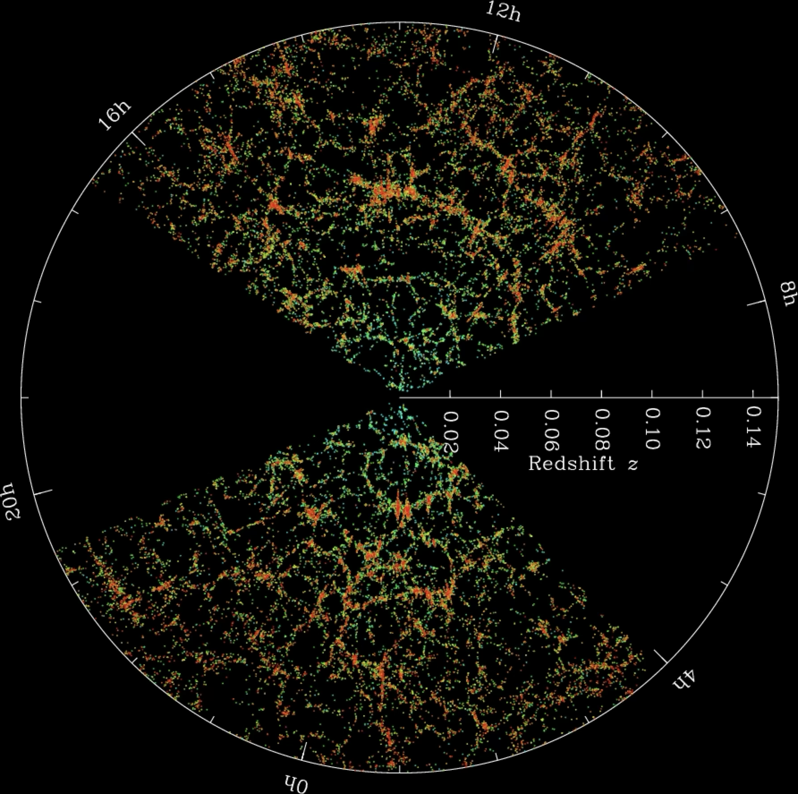{w="80%" align=center}

This visualisation shows the density of galaxies in the local Universe in a polar plot, with the radial direction representing the distance to the galaxies (as redshift) and the other the Galactic longitude. We immediately see that the galaxies are not uniformly distributed, but instead form a series of "tendrils" and "voids" that correspond to the large-scale structure of the Universe (these include groups, clusters and superclusters of galaxies). Note that in choosing how to plot the data we have made a decision on what variables to display: for example we could have plotted the data in cartesian coordinates as a 3D plot using both the Galactic longitude and latitude, but that would have made the plot harder to read and interpret.

## Types of plots

Let's now discuss different types of plots and how to choose the right one to visualise your data. This section is heavily based, and uses many plots, from the excellent [seaborn tutorials](https://seaborn.pydata.org/tutorial.html), which we will use often to generate our plots. [seaborn](https://seaborn.pydata.org/) is a plotting library that build on top of [matplotlib](https://matplotlib.org/) and provides a high-level interface for drawing attractive statistical graphics.

We will start by having a look at the different types of variables that we may encounter in our data. As we discuss different kinds of plots it will became obvious how they are associated to different types of variables. Variables can be classified in three main groups:

- A _discrete variable_ can only take certain values out of a (potentially) infinite range. E.g., natural numbers, number of pets in a household, photons received, etc.
- A _continuous variable_ can take any value in an infinite range. E.g., real numbers, height, mass, voltage, etc.
- A _categorical variable_ can take a (limited) number of values that are not necessarily numerical. E.g., months, male/female/non-binary, yes/no.

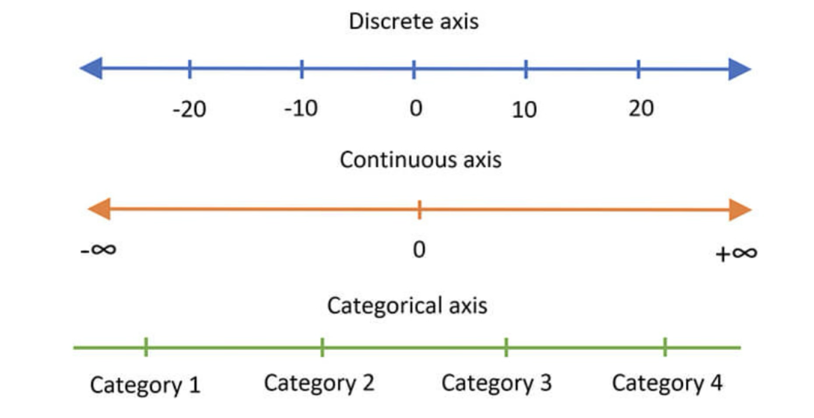{w="90%" align=center}

### Scatter plots

Scatter plots highlight the relationship between two or more continuous variables for which we have specific measurements (for example from lab experiments). For example, we may have a database that tracks the tip left by a client in a restaurant and the total bill. We can then plot the tip against the bill to see if there is a correlation between the two variables.

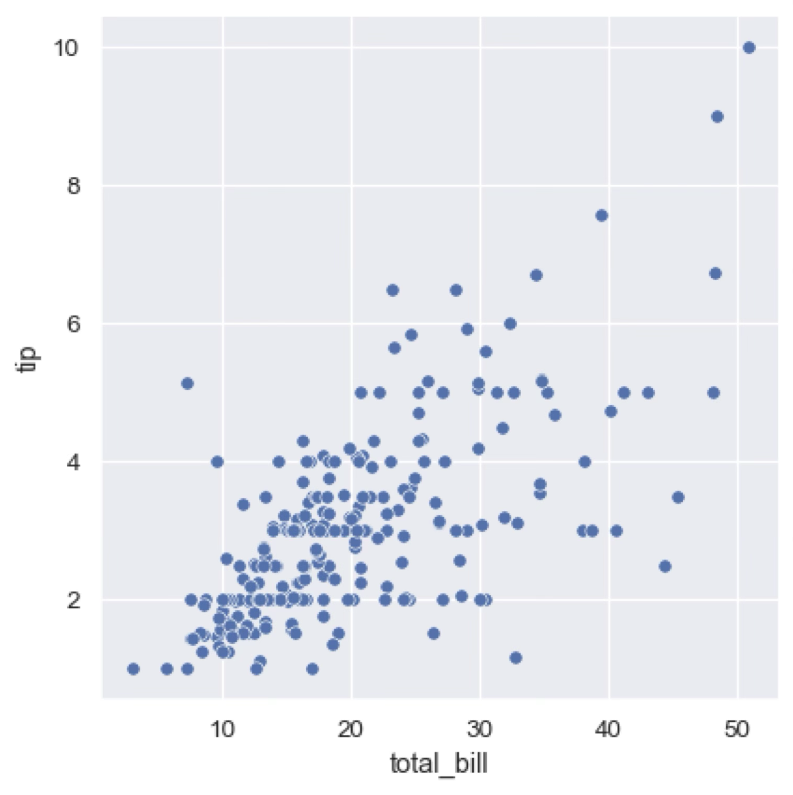{w="60%" align=center}

Additional categorical variables can be added to the plot by using different colours or shapes for the points (markers). For example, we could use different colours (hue, as we'll see later) to represent the type of restaurant (e.g., fast food, fine dining, etc.) or the day of the week, if that information is available in our dataset.

### Line plots

Line plots are used to highlight the continuous relationship between two variables. At its core they are just a scatter plot with the points connected by a line, but they are particularly useful for showing trends in the data. In the following plot with see the evolution of the price of a stock over time.

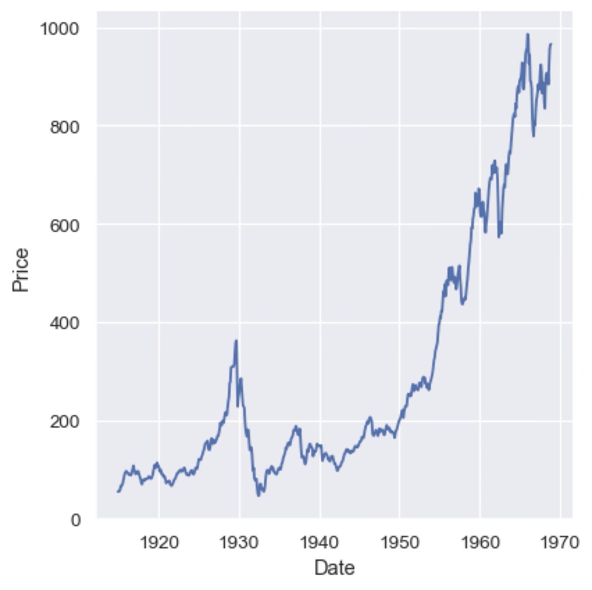{w="60%" align=center}

As in the case of scatter plots, we can use different line colours or styles (e.g., dashed, dotted) to represent additional categorical variables or to highlight specific trends in the data. We can also use shaded regions or error bars to represent the uncertainty in the measurements or the confidence intervals of the data.

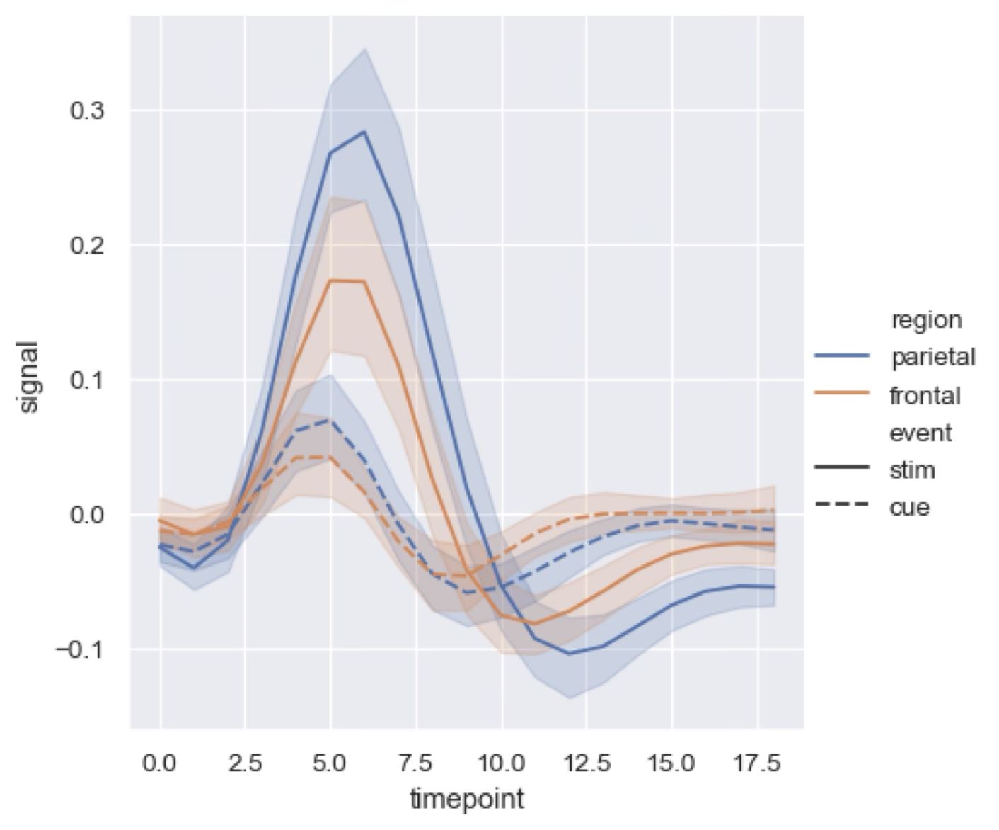{w="60%" align=center}

### Histograms and KDE

A histogram plots (or bin plots) is a representation of the distribution of a discrete or continuous variable. On the x-axis we have the possible values of the variable (either the values the variable can take in the case of a discrete variable, or a series of "bins" in the case of a continuous variable) and on the y-axis we have the number of occurrences of each value (or bin). Histograms can also represent the probability distribution of a variable.

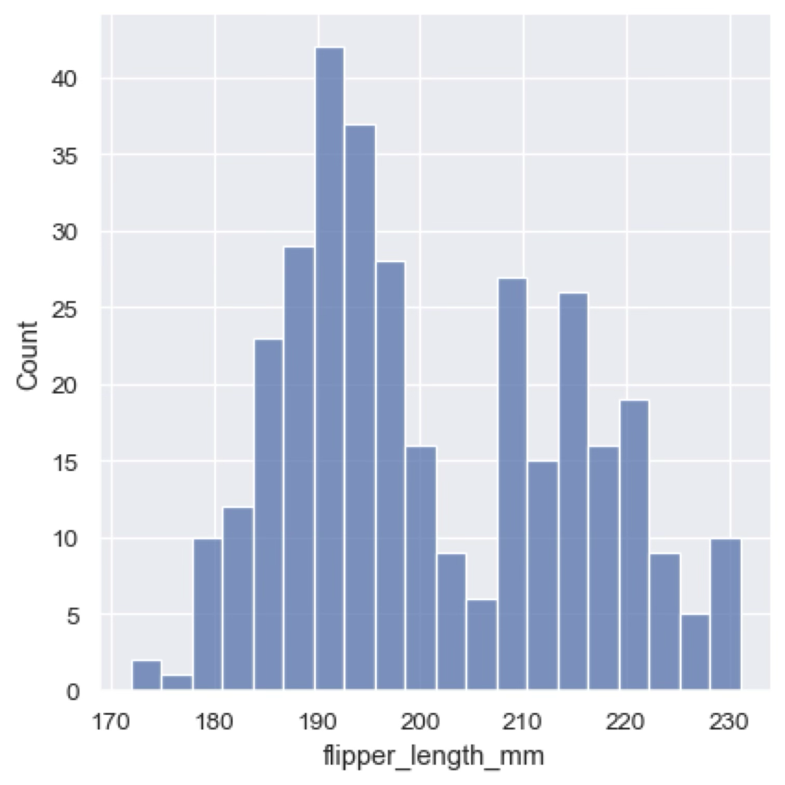{w="60%" align=center}

Histograms are critical to understand and explain the scope of our data. A good advice is always to start with a histogram of the data you are working with, as it will give you a good idea of the distribution of the variable (for example, is it a flat distribution, peaked, bimodal, etc.).

Another way to represent the distribution of a continuous variable is to use a [kernel density estimate (KDE)](https://en.wikipedia.org/wiki/Kernel_density_estimation). A KDE is a smoothed version of the histogram that uses a kernel function (usually a Gaussian) to estimate the probability density function of the variable. The result is a continuous curve that represents the distribution of the variable. KDE plots are useful to highlight the main feature of a distribution. For example, in the previous histogram the data seems to have a bimodal distribution, but this is shown much more clearly in the KDE plot below.

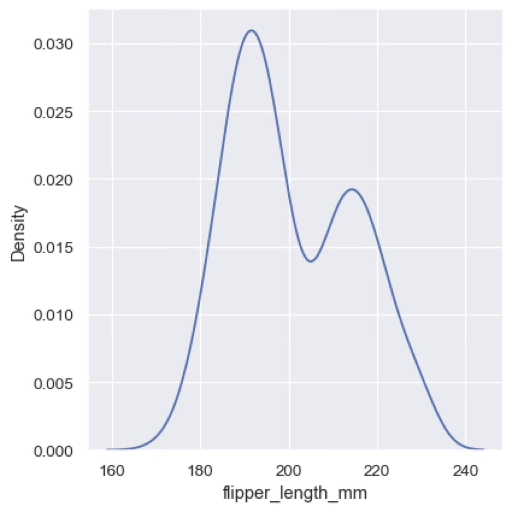{w="60%" align=center}

### Bar plots

Bar plots are used to represent values associated with a categorical or discrete variable. One axis represents the categories and the y-axis represents the associated value for each category. Bar plots are similar to histograms but they are not limited to representing the distribution of a variable. In the example below we have a categorical variable (the states of the US) and associated values (automobile collisions per billion of miles driven). We can use different colours to represent additional variables, for example the number of those collisions caused by alcohol consumption.

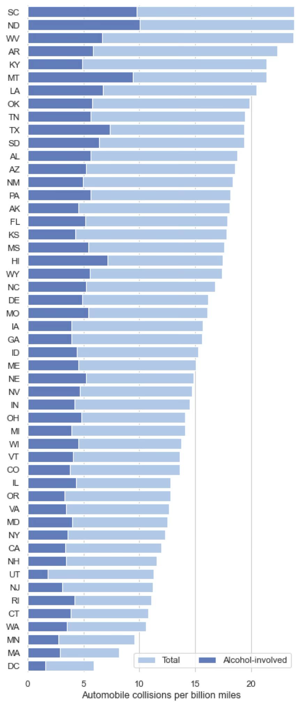{w="60%" align=center}

### Bivariate distributions

Bivariate distribution plots are similar to histograms, but in this case we have two continuous or discrete variables. The result is a 2D plot in which for each pair of values or bins we show the number of occurrences or the probability density using a colour scale. 2D histograms are very useful to understand data in visualisations where scatter plots hide the "density" of our distribution. We wil see an example of this later in this section.

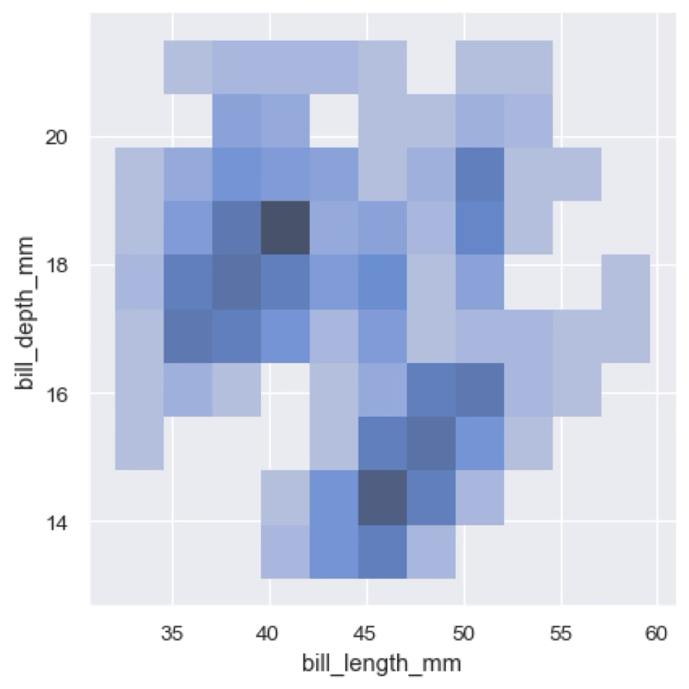{w="60%" align=center}

As in the case of univariate histograms, we can use a KDE to represent the bivariate distribution. The result is what is sometimes called a "contour plot", which shows the density of the data in a 2D space. The contour lines represent the regions of equal density.

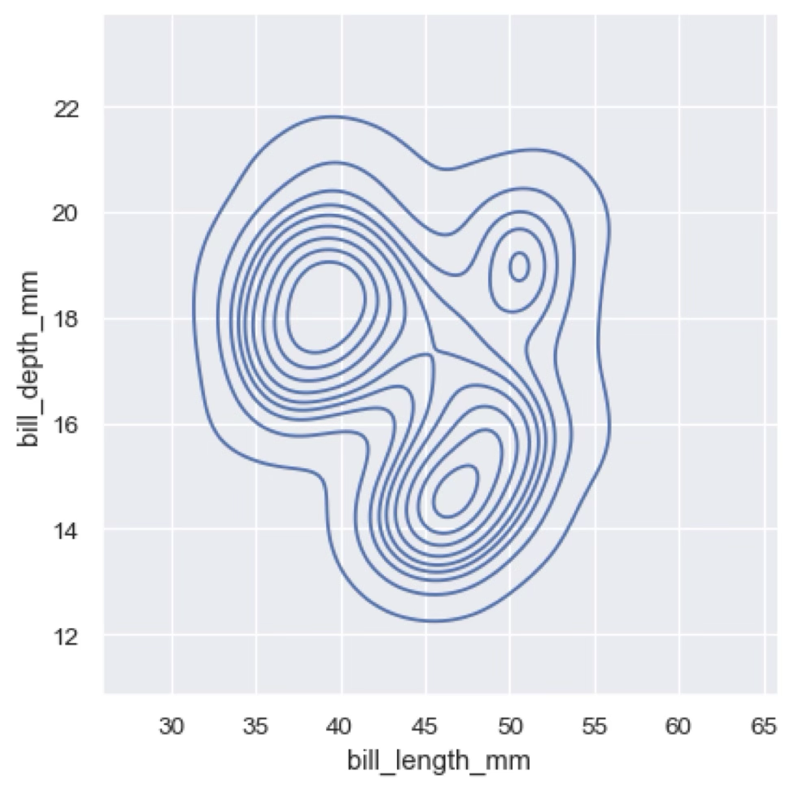{w="60%" align=center}

### Violin and box plots

Violin and box plots are used to represent the distribution of a continuous variable associated with a categorical variable. They are similar to histograms, but they show the distribution of the variable for each category. Violin plots are similar to KDE plots, but they show the distribution of the variable for each category. Box plots are a simplified version of violin plots that show the median, quartiles and outliers of the distribution.

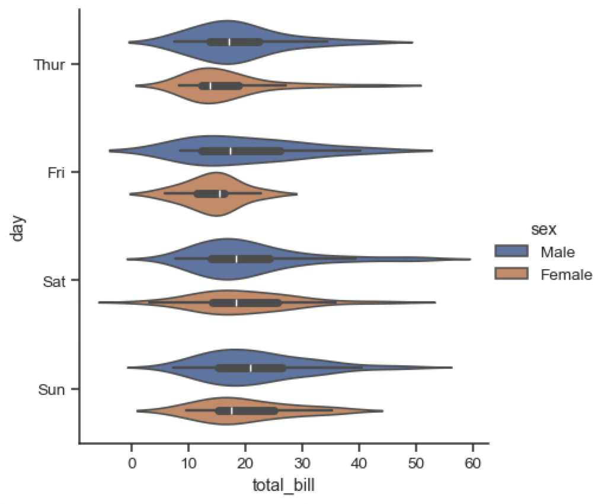{w="60%" align=center}

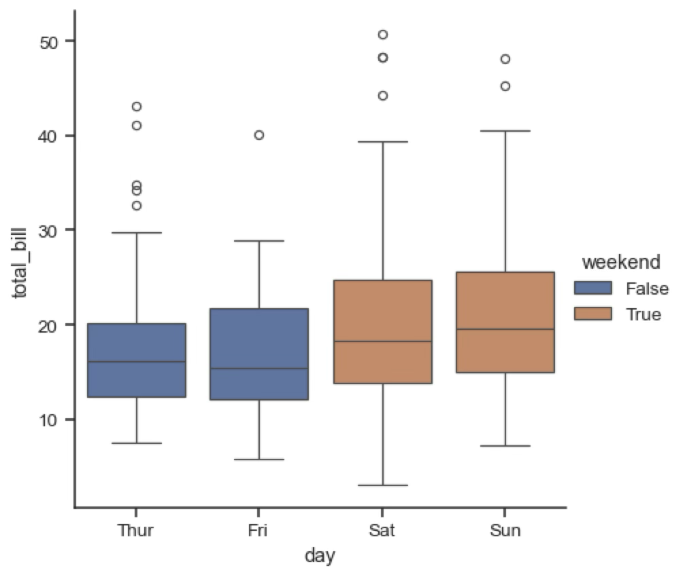{w="60%" align=center}

Violin and box plots pack a lot of information and can sometimes be hard to read, but they are useful to quickly summarise all the main feature of a distribution.

### Multigrid plots

Multigrid plots show the relationship between a set of variables. They are useful to understand the correlations between the different variables in a dataset. There are many types of multigrid plots; the following one shows the pairwise relationships between the different components of a flower. The diagonal shows the distribution of each variable as a KDE plot.

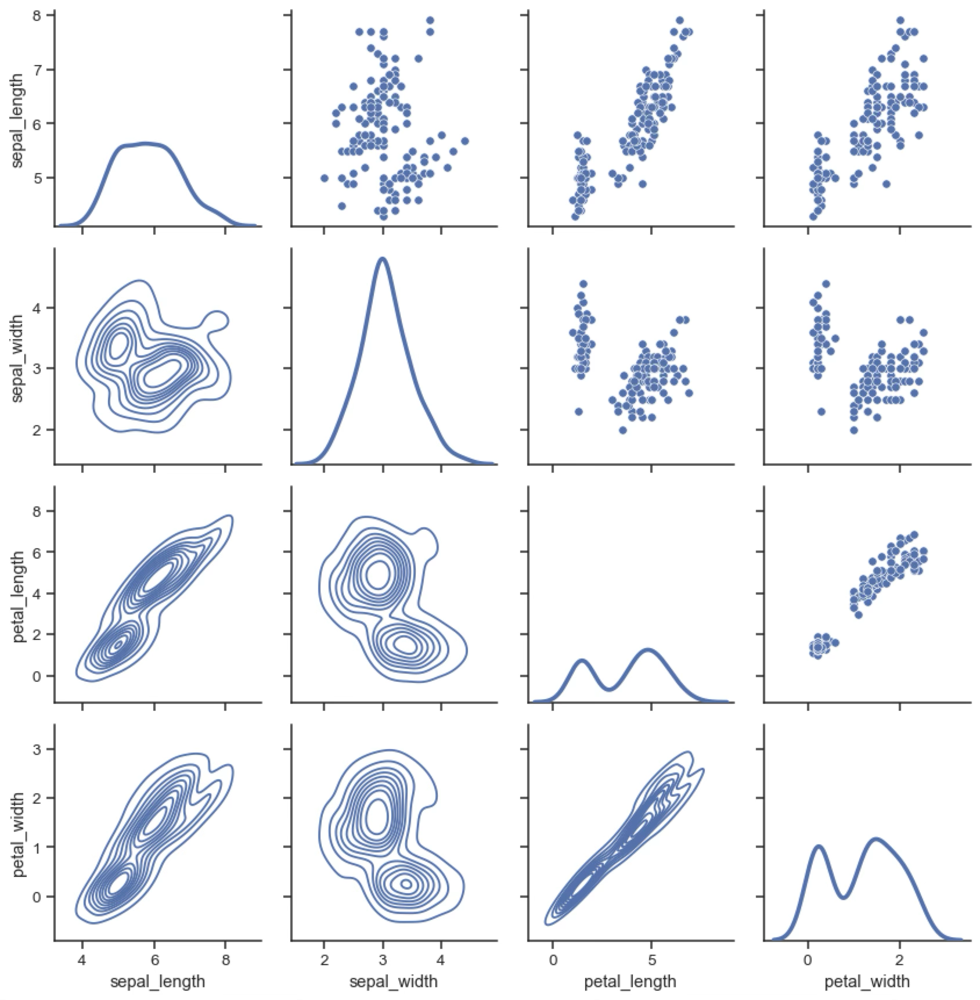{w="60%" align=center}

### Images

Images are a special case of 2D histogram in which for each element in a regular 2D grid (you can think of these as "pixels") we represent the value of the image at that spatial position. In a raw CCD image this would be the number of electrons/photons detected at that pixel. As we will see below, it's important to think about the limits and stretch of the data we are visualising.

## Colours and palettes

So far we have referred loosely to the concept of "colour" in our plots. Colour, in the data visualisation context, is defined by three elements:

- _Hue_: quality of light that distinguishes between different colours.
- _Saturation_: amount of hue present in a colour.
- _Luminance_: how dark/light a colour is.

:::{figure-md}
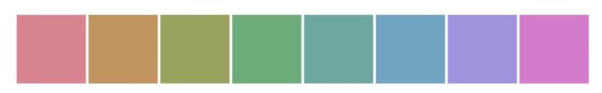{w="60%" align=center}

Hue
:::

:::{figure-md}
{w="60%" align=center}

Saturation
:::

:::{figure-md}
{w="60%" align=center}

Luminance
:::

As a general rule we use different hues to represent different categorical variables, while we use saturation and luminance to represent continuous variables. For example, in this two scatter plots we are representing the same data. On the left we use markers to differentiate between to types of data points (categorical variable), while on the right we use additionally change the hue of the markers. It's clear that the right plot makes the different variables much more distinguishable.

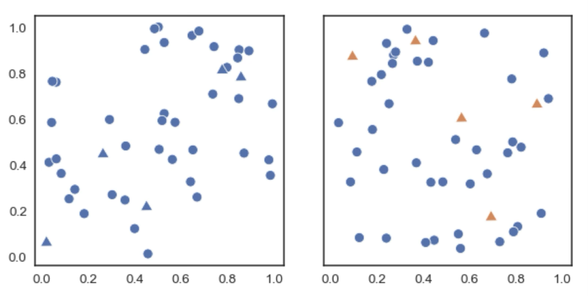{w="60%" align=center}

Similarly, we can plot a 2D histogram using different hues to represent the density of the data as we do on the left panel in the following plot. Even with a colour bar that associates hues to numerical values it's hard to visually correlate those two parameters. On the right we use a different colour palette that uses saturation to represent the density of the data, which makes it much easier to read.

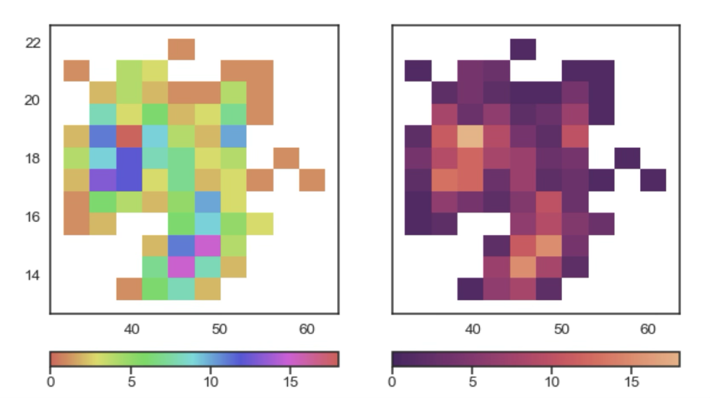{w="60%" align=center}

The range of colours that we use to represent our data is called a _colour palette_. Different colour palettes are better suited for different types of data. For discrete variables, as we saw before, we prefer a palette in which the hue changes, thus highlighting the different categories. This type of palette is called a _qualitative palette_ or _discrete palette_.

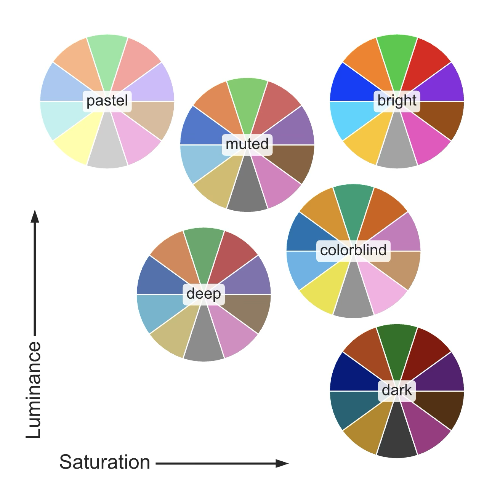{w="60%" align=center}

For continuous variables, we prefer a palette in which the hue remains constant and the saturation and luminance change, thus highlighting the different values of the variable. This type of palette is called a _sequential palette_.

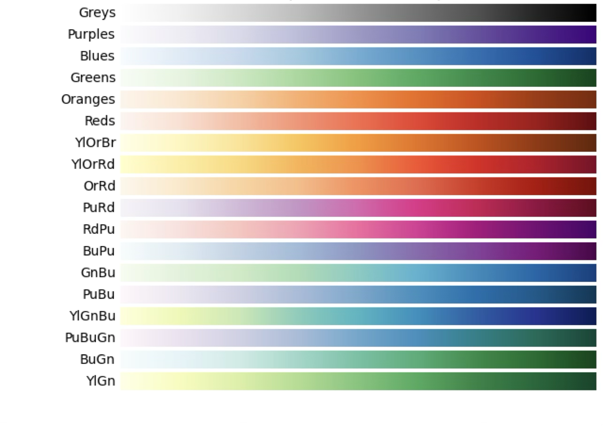{w="60%" align=center}

When we have a continuous variable that can take both positive and negative values, we need to use a different type of palette. In this case we want to highlight the two extremes (positive and negative) using different hues, while keeping the saturation and luminance constant. This type of palette is called a _diverging palette_.

For data that has both positive and negative values, or a clear tipping point, we use a _diverging palette_ that uses two different hues to represent the two extremes.

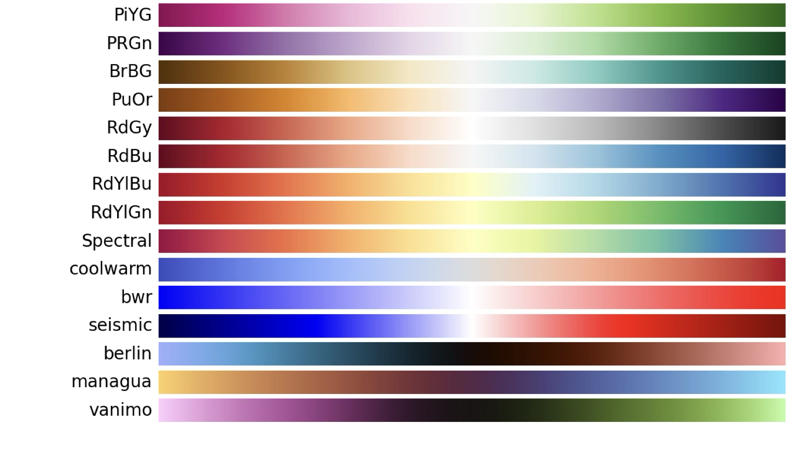{w="60%" align=center}

Choosing the right palette is critical to make our plots readable and understandable. Matplotlib and seaborn provide a wide range of colour palettes that can be used in our plots. You can find a list of the available palettes in the [seaborn documentation](https://seaborn.pydata.org/tutorial/color_palettes.html) and in the [matplotlib documentation](https://matplotlib.org/stable/tutorials/colors/colormaps.html).

Finally, it's important to remember that not all colours are distinguishable by all people. For example, people with colour blindness may have trouble distinguishing between certain hues. To make our plots accessible to everyone, we should use colour palettes that are friendly to colour blindness. The following image shows several discrete palettes and how they are perceived by people with different types of colour blindness (deuteranopia and protanopia).

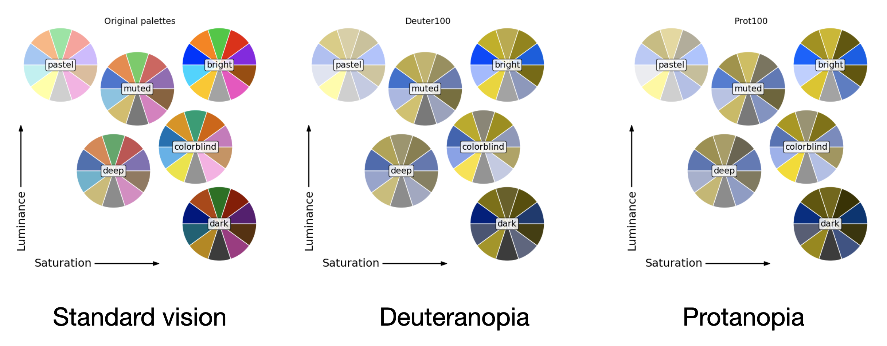{w="100%" align=center}

A good resource to check how your plots look like for people with colour blindness is the [Color Universal Design (CUD) website](https://jfly.uni-koeln.de/color/), which provides a detailed explanation of how colour blindness affects perception. This [page](https://davidmathlogic.com/colorblind/) also provides a good overview of the different types of colour blindness and how to make your plots accessible to everyone.

## Displaying astronomical images

Let's now focus on a specific type of data visualisation that is very common in astronomy: displaying astronomical images. We have already seen how to do this in previous sections and using DS9, but now we'll introduce a few additional concepts.

When displaying image data we need to consider three main aspects: what range of data values we want to display (the interval), how we are mapping the data values to colours (the stretch, e.g., linear or logarithmic), and the colour palette we are using. Let's look at these in detail with an example.

We will start by displaying one of our [reduced CCD images](#basic-ccd-reductions) using [matplotlib.imshow](https://matplotlib.org/stable/api/_as_gen/matplotlib.pyplot.imshow.html). This function displays a 2D array as an image, with the values of the array mapped to colours using a colour palette.

```{code-cell} ipython3
:tags: [remove-cell]
os.chdir(CCD_DATA_DIR)
```

```{code-cell} ipython3
data = fits.getdata('ccd.037.0_proc.fits').astype('f4')
_ = plt.imshow(data, cmap='gray', origin='lower')
```

We do not see a lot of detail in this image. As we commented before, it's always a good idea to start with a histogram of the data to understand its distribution. Let's do that now. We will use the `seaborn.histplot` function to plot the histogram of the data values.

```{code-cell} ipython3
# Set up seaborn style to make the plots look nice
seaborn.set_theme('paper', color_codes=True, palette='deep', font_scale=1.2)

# Print some statistics of the data
print(f'Min: {data.min():.2f}')
print(f'Max: {data.max():.2f}')
print(f'Mean: {data.mean():.2f}')
print(f'First quartile: {numpy.percentile(data, 25):.2f}')
print(f'Ninety-ninth percentile: {numpy.percentile(data, 99):.2f}')

_ = seaborn.histplot(data.flatten(), bins=100)
```

Even when we define a hundred bins we see that most of the data values are concentrated in a very small range. The 99% percentile tells us that 99% of the data values are below 869 counts, but we have at least some values going as high as 58300 counts. Let's redo the plot but displaying only the values below 1000 counts.

```{code-cell} ipython3
data_low = data[(data < 1000) & (data > 0)]
_ = seaborn.histplot(data_low.flatten(), bins=100)
```

With this information, let's plot the image again, but this time using some data limits, which in `imshow` with can pass using the `vmin` and `vmax` parameters.

```{code-cell} ipython3
seaborn.set_style('white')

_ = plt.imshow(data, cmap='gray', origin='lower', vmin=600, vmax=800)
```

That's significantly better! What we have done is to adjust the interval of the data that we are displaying. [astropy.visualization](https://docs.astropy.org/en/stable/visualization/index.html) provides a set of functions to help with this process, including `astropy.visualization.ImageNormalize`, which allows us to normalise the data values to a specific range.

There are, generally, two algorithms for data range interval: minmax and z-scale. The former simply displays all the values. The latter does something similar to what we did with the histogram but using a faster, less precise algorithm. The details can be found [here](https://astro.uni-bonn.de/~sysstw/lfa_html/iraf/images.tv.display.html).

```{code-cell} ipython3
from astropy.visualization import ZScaleInterval, MinMaxInterval

zscale = ZScaleInterval()
minmax = MinMaxInterval()

print(f'Z-scale interval: {zscale.get_limits(data)}')
print(f'Minmax interval: {minmax.get_limits(data)}')
```

See how the range of values in the z-scale interval is very similar to the ones we found using the histogram. To use this interval we can create a matplotlib normalisation object and pass it to `imshow`.

```{code-cell} ipython3
from astropy.visualization import ImageNormalize, LinearStretch

norm = ImageNormalize(data, interval=ZScaleInterval())
_ = plt.imshow(data, cmap='gray', origin='lower', norm=norm)
```

So far we have used a linear mapping between the values of the image and the colour levels (saturation and luminance). We can also use a logarithmic mapping, which is useful to highlight faint features in the image. To do this we can use the `LogStretch` class from `astropy.visualization`.

```{code-cell} ipython3
from astropy.visualization import LogStretch

norm_log = ImageNormalize(data, interval=ZScaleInterval(), stretch=LogStretch())
_ = plt.imshow(data, cmap='gray', origin='lower', norm=norm_log)
```

There are other stretches available in `astropy.visualization`, such as `SqrtStretch` and `AsinhStretch`, which can also be useful depending on the characteristics of the data being visualized.

Finally, let's look at the colour palettes for visualising data. Until now we have used a simple grayscale palette, but we can use other palettes to highlight different features in the data. CCD data is typically sequential, so we will generally want to use a sequential palette. For example, we can use the `viridis` palette, which is a good choice for displaying data with a wide range of values.

```{code-cell} ipython3
norm = ImageNormalize(data, interval=ZScaleInterval(), stretch=LinearStretch())
_ = plt.imshow(data, cmap='viridis', origin='lower', norm=norm)
```

Again, you can check all the available palettes in the [matplotlib documentation](https://matplotlib.org/stable/tutorials/colors/colormaps.html). All palettes accept a `_r` suffix to reverse the colours. For example, let's use a heat-like palette

```{code-cell} ipython3
_ = plt.imshow(data, cmap='YlOrBr_r', origin='lower', norm=norm)
```

### Creating RGB images

It's important to differentiate between monochromatic data (e.g., a single CCD image) displayed using a colour map that uses different hues, and RGB images. The latter are created by combining three or more monochromatic images, each representing a different colour channel (red, green and blue).

RGB images are not very common in astronomy, but they are sometimes useful to visually identify features in the data (e.g., blue vs red galaxies), and to create beautiful images of astronomical objects. Ideally, an RGB image would result in an image that the human eye would perceive as a "natural" representation of the object being observed, assuming that our eye was more sensitive. In practice there is a certain element of subjectivity and multiple algorithms exist to create RGB images from monochromatic data. Astropy has a useful page on [how to create RGB images](https://docs.astropy.org/en/stable/visualization/rgb.html) so we will not repeat that here.
