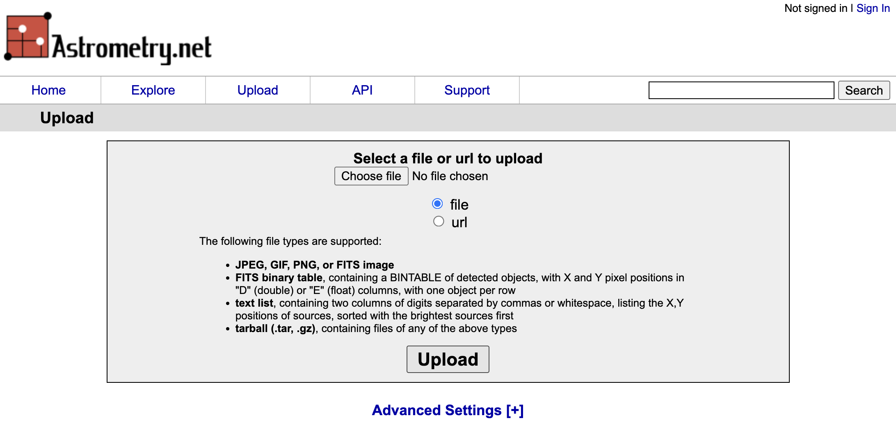
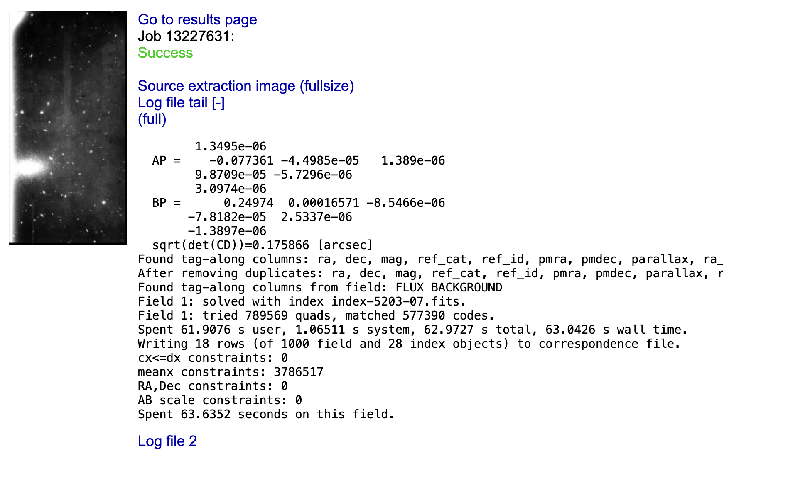

```{code-cell} ipython3
:tags: [remove-cell]

%matplotlib inline

import os
import seaborn
from astropy.io import fits
from astropy.visualization import ZScaleInterval, ImageNormalize, LinearStretch
from matplotlib import pyplot as plt

seaborn.set_palette('deep', color_codes=True)
plt.ion()

# Change these paths to point to the location of your data
LFC_DIR = '../../data/example-cryo-LFC/'
ANDOR_DIR = '../../data/ccd_reductions_data/'

# This moves the current working directory to the location of the LFC data
os.chdir(LFC_DIR)

```

# Photometry and CCD calibrations

Once your data has been taken and [reduced](#basic-ccd-reductions) it is the time to perform analysis on it. The scope of that analysis will depend on the type of data and the science goals of your project. Here we will focus on two main topics: aperture photometry and astrometric registration.

## Aperture photometry

At its core aperture photometry is just summing up the pixels values around a give position or source. The term "aperture" refers to the geometric shape (usually circular but potentially a ellipse or a polygon) used to define the area of the image that will be summed. It is possible to do aperture photometry by hand, but there are subtleties such as the handling of background noise and subpixel regions that are not totally trivial. Because of that we will use a package, [photutils](https://photutils.readthedocs.io/en/stable/), that implements many of the algorithms and methods used in aperture photometry. Note that `photutils` is not, by far, the only package available that can do this, and that its scope is larger than just aperture photometry.

For the purposes of this tutorial we will use the image `ccd.037.0_proc.fits` that we created in the [basic CCD reductions](#basic-ccd-reductions-science) section.

```{code-cell} ipython3
ccd37_proc = fits.open('ccd.037.0_proc.fits')
ccd37_proc_data = ccd37_proc[0].data.astype('f4')

# Plot the flat image
norm = ImageNormalize(ccd37_proc_data, interval=ZScaleInterval(), stretch=LinearStretch())
_ = plt.imshow(ccd37_proc_data, origin='lower', norm=norm, cmap='YlOrBr_r')
```

### Source detection

Often we know what sources we want to measure on an image, but its also common to want to measure all the available sources, or those that match some criteria. While detecting sources is something the human eye and brain are quite good at, it's not trivial to implement a computer algorithm that can do this in a robust and efficient way. [photutils.detection](https://photutils.readthedocs.io/en/latest/user_guide/detection.html) provides to well tested algorithms for quickly (but somewhat loosely!) identifying sources in an image: `DAOStarFinder` and `IRAFStarFinder`. Both of these algorithms are based on the idea of convolving the image with a kernel that is sensitive to point sources. We will use `DAOStarFinder` here with a very basic configuration, but note that it's important to understand the parameters of the algorithm and how they affect the results.

`DAOStarFinder` requires defining two parameters: the `fwhm` of the sources, and the noise `threshold` above which we consider a pixel to be a part of a region. The `fwhm` parameter is the full width at half maximum of the Gaussian kernel used to convolve the image and its somewhat less critical as long as it's not larger than the real FWHM of the image. This value must be given in pixels. Since the pixel scale of the LFC camera is ~ 0.18 arcsec/pixel, if we assume an average seeing of 1 arcsec, the FWHM of the sources in the image is about 5 pixels.

To determine the threshold we can use `sigma_clipped_stats` from `astropy` to get mean, median, and standard deviation of a blank region on the image. Here we are interested in the standard deviation, which is a measure of the background noise after the reduction process.

```{code-cell} ipython3
from astropy.stats import sigma_clipped_stats

# Select a blank region of the image
data_blank = ccd37_proc_data[1000:1100, 800:1000]

# Calculate the mean, median and standard deviation of the blank region
mean, median, std = sigma_clipped_stats(data_blank, sigma=3.0)
print(f'Mean: {mean:.2f}, Median: {median:.2f}, Std: {std:.2f}')
```

Now let's use these values to run `DAOStarFinder`. We will set the threshold to 5 times the standard deviation, which is a good starting point to detect sources that are likely to be real. Note that we will subtract the median background from the image before running the source detection algorithm. This is important in cases where the background is significant.

```{code-cell} ipython3
from photutils.detection import DAOStarFinder

# Run DAOStarFinder
daofind = DAOStarFinder(fwhm=5.0, threshold=5*std)
sources = daofind(ccd37_proc_data - median)

print(sources)
```

The result is an astropy [table](https://docs.astropy.org/en/stable/table/index.html) in which each row corresponds to a detected source. The columns of the table contain the x and y coordinates of the sources, as well as their fluxes and other properties. Note that the magnitudes and fluxes here are instrumental (based on ADU values) and not calibrated. The `xcentroid` and `ycentroid` columns are the positions of the sources in pixels.

```{important}
The centroids returned by `DAOStarFinder` are determined using a algorithm that is efficient but not very precise. It is recommended that you recalculate these centroids using a more precise algorithm, as we will see in the next section.
```

Let's plot the detected sources on top of the image.

```{code-cell} ipython3
_ = plt.imshow(ccd37_proc_data, origin='lower', norm=norm, cmap='YlOrBr_r')

# Plot the detected sources
_ = plt.scatter(sources['xcentroid'], sources['ycentroid'], s=10, c='red', marker='x')

# Zoom on a region of the image for better visibility

_= plt.xlim(500, 1500)
_ = plt.ylim(1000, 2000)

```

Note that while most of the source that we have detected look like real stars (or sometimes galaxies), there are also many sources that we have not identified. These regions are either too faint (they can be recovered by reducing the threshold) or are not well fit by a Gaussian profile (like extended galaxies). You may also find that some of the sources have multiple detections. This usually happens when the FWHM is not properly defined but can also happen in very bright, saturated sources.

### Centroiding

Next, let's look at better ways to determine the centroid of our sources. The easiest, naive approach to this problem would be to just select the pixel with the maximum value in the region we are interested in. This has two problems: first, we may have spurious signal in some pixels (for example cosmic rays) that are not part of the source and that affect our centroiding; and second, this only allows us to determine the centroid to the integer pixel value level, which is not very precise. A better approach is to assume that the source of interest follows a given profile (usually a Gaussian or a Lorentzian for point source ---stars, but the profile may be different for other types of object and depending on our optical system) and fit the profile function to the data. This is technically the most precise way to determine the centroid, but it is also the most computationally expensive.

In the middle sit a number of algorithm that try to find a balance between speed and precision. The package [photutils.centroids](https://photutils.readthedocs.io/en/latest/user_guide/centroids.html) implements a number of these algorithms. Their use is similar so here we will use the `centroid_1dg` algorithm, which fits 1D Gaussians to the x and y marginal distributions of the source (you can think of this as "collapsing" the source along the x and y axes and then fitting a Gaussian to the resulting 1D distributions). This is a good compromise between speed and precision, and it is also very robust to noise.

For this we will use one of the source we detected in the previous step at $x\sim999$ and $y\sim1932$.

```{code-cell} ipython3
from photutils.centroids import centroid_1dg

# Centroids of the source from DAOStarFinder
xd = 999.2980968694505
yd = 1932.5177532355156

# Get a small region around the source

x0 = int(xd)
y0 = int(yd)
data = ccd37_proc_data[y0-10:y0+10, x0-10:x0+10]

# Calculate the centroid using the 1D Gaussian algorithm.
# It's important to remove the median background!
xc, yc = centroid_1dg(data - median)

# This centroid is with respect to the region we selected, so we need to add the offset
xc += (x0 - 10)
yc += (y0 - 10)

print(f'Centroid: {xc:.2f}, {yc:.2f}')

# Let's plot the two centroids estimates.
norm = ImageNormalize(data, interval=ZScaleInterval(), stretch=LinearStretch())
_ = plt.imshow(data, origin='lower', norm=norm, cmap='YlOrBr_r')
_ = plt.scatter(xd - x0 + 10, yd - y0 + 10, s=100, c='red', marker='x', label='DAOStarFinder')
_ = plt.scatter(xc - x0 + 10, yc - y0 + 10, s=100, c='blue', marker='x', label='Centroid 1D Gaussian')
_ = plt.legend()
```

As you can see the difference is often at the subpixel level, but that can be important depending on the analysis that you are trying to perform.

### Simple aperture photometry

Now that we have the exact centroid of our source we can actually perform aperture photometry. We'll start by defining a circular aperture with a radius of 10 pixels. [photurils.aperture](https://photutils.readthedocs.io/en/latest/user_guide/aperture.html) provides a number of aperture shapes, including circular, elliptical, and annular. We will use the `CircularAperture` class to define our aperture.

```{code-cell} ipython3
from photutils.aperture import CircularAperture

# Define the aperture
aperture = CircularAperture((xc, yc), r=10)

# Plot the aperture on top of the image
_ = plt.imshow(ccd37_proc_data, origin='lower', norm=norm, cmap='YlOrBr_r')
_ = aperture.plot(color='red', lw=2, label='Aperture')
_ = plt.xlim(900, 1100)
_ = plt.ylim(1800, 2100)
```

So far we have not extracted any data from the image, we have just defined an abstraction of a circular aperture. To actually extract the data we need to use the `aperture_photometry` function.

```{code-cell} ipython3
from photutils.aperture import aperture_photometry

# Perform aperture photometry
phot_table = aperture_photometry(ccd37_proc_data - median, aperture)
print(phot_table)
```

The resulting table contains the x and y centroids that we provided (we defined an aperture for a single region but it would have been possible to define the same aperture for multiple regions) and the total sum of the pixels in the aperture. Note that we again subtracted the median background since that is signal that is not part of our source.

Let's consider the case in which we want to measure the flux on the same region using apertures with multiple radii. For that we need to define multiple apertures and pass them to `aperture_photometry`.

```{code-cell} ipython3
# Define the apertures between r=1 and r=50
radii = range(1, 51, 1)
apertures = [CircularAperture((xc, yc), r=r) for r in radii]

# Perform aperture photometry
phot_table = aperture_photometry(ccd37_proc_data - median, apertures)

print(phot_table)
print(phot_table.colnames)
```

There `phot_table` table now contains a column for each one of the apertures we defined. We can plot the growth curve with a bit of table manipulation.

```{code-cell} ipython3
# Get the region we are interested in from the table
region = phot_table[0]

# Convert the values to a list
region_data = list(region.values())

# Exclude the first three values, which are the id, x, and y coordinates
fluxes = region_data[3:]

# Plot the growth curve
_ = plt.plot(radii, fluxes, marker='o')
_ = plt.xlabel('Aperture radius (pixels)')
_ = plt.ylabel('Flux (ADU)')
```

:::{note}
Although we won't discuss the details here, `photutils.aperture` also provides aperture classes that can be defined using sky coordinates (RA, Dec) instead of pixels, assuming that the image has the proper WCS information. Other than how the aperture is defined, the rest of the process is the same.
:::

### Local background subtraction

In the previous growth curve we saw that the flux grows with the aperture but never really plateaus. This is because, although we are subtracting the median image background, the background around the source is likely different and we are not properly estimating it. A better approach is to measure the background around our source using an annular aperture with a radius that is large enough to make sure that it does not include any of the source signal but is not so large as to not being representative of the local background. The best radius can be determined by eye or, better, using a radial profile as we will see in the next section. For now we will use an annulus with an inner radius of 30 pixels and a width of 5 pixels, which according to the previous plots should work well enough.

```{code-cell} ipython3
from photutils.aperture import CircularAnnulus

# Define the annulus
annulus = CircularAnnulus((xc, yc), r_in=30, r_out=35)

# Plot the annulus
_ = plt.imshow(ccd37_proc_data, origin='lower', norm=norm, cmap='YlOrBr_r')
_ = annulus.plot(color='blue', lw=2, label='Annulus')
_ = plt.xlim(900, 1100)
_ = plt.ylim(1800, 2100)
```

Now let's perform aperture photometry on the annulus and estimate the background. We could do this manually but instead we will use the `ApertureStats` class.

```{code-cell} ipython3
from photutils.aperture import ApertureStats

annulus_stats = ApertureStats(ccd37_proc_data, annulus)
back = annulus_stats.median
std = annulus_stats.std
print(f'Background per pixel: {back:.3f}')
```

Now we can use define a region around our source and subtract this background. The best way to do this is to calculate the raw flux and then subtract the background multiplied by the area of the aperture.

```{code-cell} ipython3
aperture = CircularAperture((xc, yc), r=30)

phot_table = aperture_photometry(ccd37_proc_data, aperture)
flux = phot_table['aperture_sum'][0]
aperture_area = aperture.area_overlap(ccd37_proc_data)
flux_no_back = flux - back * aperture_area

print(f'Flux (raw): {flux:.3f}')
print(f'Background: {back:.3f}')
print(f'Area: {aperture_area:.3f}')
print(f'Flux (without background): {flux_no_back:.3f}')
```

The resulting flux, after subtracting the background, is much lower than the raw flux. The background in this image is very significant (this is not the bias or dark levels, we removed those, but the sky background) and it's critical to subtract it properly.

Let's repeat our growth curve analysis but using the local background subtraction.

```{code-cell} ipython3
radii = range(1, 31, 1)
apertures = [CircularAperture((xc, yc), r=r) for r in radii]

# Calculate the raw flux for each aperture
phot_table = aperture_photometry(ccd37_proc_data, apertures)
region = phot_table[0]
region_data = list(region.values())
fluxes = region_data[3:]

# For each aperture estimate the area and subtract the background
fluxes_no_back = []
for i, r in enumerate(radii):
    aperture = apertures[i]
    aperture_area = aperture.area_overlap(ccd37_proc_data)
    flux_no_back = fluxes[i] - back * aperture_area
    fluxes_no_back.append(flux_no_back)

# Plot the growth curve
_ = plt.plot(radii, fluxes_no_back, marker='o')
_ = plt.xlabel('Aperture radius (pixels)')
_ = plt.ylabel('Flux (ADU)')
```

That's significantly better! This also tells us that probably all the flux in our source is contained in a radius of about 15 pixels (of course we can define this more precisely by, for example, estimating when the cumulated flux increases by less than 1%).

### Radial profile

A radial profile is a measurement or plot of the flux per unit of area as a function of the distance from the centre of the source. It's directly related to the growth curve we saw before. [photurils.profiles](https://photutils.readthedocs.io/en/latest/user_guide/profiles.html) provides a way to calculate the radial profile of a source along with a Gaussian fit to the data. We'll calculate the radial profile of the source we have been using so far.

```{code-cell} ipython3
from photutils.profiles import RadialProfile

# Define the radii
radii = range(0, 31, 1)

# Create the radial profile
rp = RadialProfile(ccd37_proc_data, (xc, yc), radii)

# Print the radii and profile values
print(rp.radius)
print(rp.profile)
```

Note that there is a difference between the radii that we provide (which are the "edge" radii) and the values in the `radius` attribute, which are the average radii of each annular region around the source. The `profile` is the average flux including all the pixels in the annular region for that radial distance. As we get to larger radii the values settle around 700, which is the background level we measured before. We have not removed the background from the profile, so let's do that now and plot the resul.

```{code-cell} ipython3
rp = RadialProfile(ccd37_proc_data - back, (xc, yc), radii)

# Plot the radial profile
_ = plt.plot(rp.radius, rp.profile)
```

`RadialProfile` also provides a fit to the data using a Gaussian profile.

```{code-cell} ipython3
print(rp.gaussian_fit)
```

This is simply a [Gaussian1D](https://docs.astropy.org/en/stable/api/astropy.modeling.functional_models.Gaussian1D.html) object representing a 1D Gaussian function

$$
f(x) = A \cdot e^{-\frac{(x - x_0)^2}{2 \sigma^2}}
$$

where $A$ is the amplitude, $x_0$ is the position of the peak, and $\sigma$ is the standard deviation. Let's evaluate that function and overplot it on top of the radial profile.

```{code-cell} ipython3
# Create a grid of r values
rr = numpy.linspace(0, 30, 100)

# Evaluate the Gaussian function
gaussian = rp.gaussian_fit(rr)

# Plot the radial profile
_ = plt.plot(rp.radius, rp.profile, label='Radial profile')
_ = plt.plot(rr, gaussian, label='Gaussian fit')
_ = plt.xlabel('Radius (pixels)')
_ = plt.ylabel('Flux (ADU)')
_ = plt.legend()
```

As you can see our Gaussian fit is a very good approximation to the data except towards large radius where the wings of the PSF ar not totally Gaussian. You can try fitting other functions (for example a Moffat or Laurentzian profile) to see if they do better.

## Astrometric registration

Although telescope tracking is usually very good, it is not perfect over long periods of time. This can be compensated by the use of active guiding in which a different camera or system is used to measure the pointing of the telescope and adjust it every few seconds. Even in this case, multiple images of the same object may not be perfectly aligned, for example if the telescope has been moved between images or if we are using different filters. Often we will want to align different images of the same object, for example if we are going to combine them to increase the signal to noise ratio, or to be able to use the same centroids and apertures to perform photometry on all the images.

There are different ways in which images can be aligned. On first order, the alignment is just an [affine transformation](https://en.wikipedia.org/wiki/Affine_transformation) between the pixels of both images (that is, a translation, rotation, and maybe scale change). In practice there may be higher order effects, especially if the images cover a large field of view where the distortion of the optics may be significant. Here we will discuss a different approach in which we first generate a [World Coordinate System](https://fits.gsfc.nasa.gov/fits_wcs.html) (WCS) transformation for each image and then use that information to "reproject" the images to a common grid. A WCS is a set of FITS header keywords and values that provides a transformation between pixel coordinates and sky coordinates (usually RA/Dec but sometimes others). The WCS standard is complex and additional keywords can be added to make the transformation more precise, but usally you'll see the following keywords:

```text
WCSAXES =                    2 / no comment
CTYPE1  = 'RA---TAN-SIP' / TAN (gnomic) projection + SIP distortions
CTYPE2  = 'DEC--TAN-SIP' / TAN (gnomic) projection + SIP distortions
EQUINOX =               2000.0 / Equatorial coordinates definition (yr)
LONPOLE =                180.0 / no comment
LATPOLE =                  0.0 / no comment
CRVAL1  =         138.98112419 / RA  of reference point
CRVAL2  =        52.8164738445 / DEC of reference point
CRPIX1  =        746.863628387 / X reference pixel
CRPIX2  =        2601.61639404 / Y reference pixel
CUNIT1  = 'deg     ' / X pixel scale units
CUNIT2  = 'deg     ' / Y pixel scale units
CD1_1   =   -4.89565776626E-05 / Transformation matrix
CD1_2   =   -4.59718481848E-07 / no comment
CD2_1   =   -2.13323012117E-07 / no comment
CD2_2   =     4.8924167814E-05 / no comment
```

[astropy.wcs](https://docs.astropy.org/en/stable/wcs/index.html) provides a series of tools to use and generate WCS information. We will see two approaches to generating WCS information for an image without it: using astrometry.net and creating it from known stars on the image.

### Using astrometry.net

[astrometry.net](http://astrometry.net/) is a widely used algorithm to perform "blind" astrometric registration of images. "Blind" here means that the algorithm doesn't need to know anything about where the telescope was pointing when we took the image or the characteristics of the system (field of view, image scale). That said, astrometry.net often works better if some of that information is provided. The algorithm works by identifying groups of four stars (called quads), creating a normalised structure representing the quads, and comparing them with a large, precomputed database of such quad structures. When enough matches are found, the algorithm determines that the it knows where the image is pointing and generates a WCS transformation for it. astrometry.net also provides a web service where you can upload and "solve" your images. For that go to [https://nova.astrometry.net](https://nova.astrometry.net) and click on Upload. Now you can select an image and upload it.



After a few seconds you should see a progress page and, if the image can be astrometrycally solved, you will get a "Success" message. You can then click on "Go to results page".



On the right side of the result page you can click on the `new-image.fits` to download a copy of your image with the WCS information added to the header, or `wcs.fits` which contains only a FITS header with the WCS information (no image data).

### Manually creating a WCS

If you image has too few stars astrometry.net is likely to fail (in average astrometry.net needs at least 8-10 stars to solve the image). In this case you can try to create a WCS manually. This requires you to figure out the coordinates of at least some of the stars on your image (the more the better). You can do this in multiple ways, by querying a known catalogue like Gaia or SDSS around the known centre of your image, or using a tool like [Aladin](https://aladin.u-strasbg.fr/) to manually match the stars you are seeing to known stars. Once you have the coordinates of the stars and their associated pixel coordinates (it helps if you use a centroiding method like the one we saw earlier rathern than visually deciding what is the central pixel), we can use [astropy.wcs.utils.fit_wcs_from_points](https://docs.astropy.org/en/stable/api/astropy.wcs.utils.fit_wcs_from_points.html#astropy.wcs.utils.fit_wcs_from_points) to create the WCS transformation.

```{code-cell} ipython3
# Let's assume these are the x and y coordinates of the stars we found
x = [1331.3568115234375,
     1996.116943359375,
     2008.965087890625,
     215.91859436035156,
     162.48562622070312,
     194.13113403320312,
     623.3280029296875,
     1002.7437133789062,
     1383.0045166015625,
     533.0752563476562]

y = [2535.110107421875,
     1694.0184326171875,
     3549.899658203125,
     851.3917236328125,
     3353.468994140625,
     726.9962158203125,
     3613.446533203125,
     525.7298583984375,
     2291.5869140625,
     1997.260009765625]

# And the associated RA and Dec coordinates
ra = [138.94786322276144,
      138.90368975221398,
      138.96405273693716,
      138.9513195308238,
      138.9499430926342,
      138.90056898449305,
      138.88681671835002,
      139.0222296563415,
      138.96284185068438,
      138.93741717327015]

dec = [52.80312251879186,
       52.84730345919048,
       52.769005157018285,
       52.89335543183549,
       52.7833381349152,
       52.83300372603977,
       52.86023955756058,
       52.78176122196098,
       52.81655280388421,
       52.87733744902463]

# Create SkyCoord objects
from astropy.coordinates import SkyCoord
coords = SkyCoord(ra, dec, unit='deg', frame='icrs')

# Create the WCS object. Note that the xy coordinates should use (1, 1) indexing
# for the lower left corner of the image (FITS standard).
from astropy.wcs.utils import fit_wcs_from_points

wcs = fit_wcs_from_points((numpy.array(x), numpy.array(y)), coords, projection='TAN')

# Print the WCS information as a header
wcs.to_header()

# Let's add this to the image header
ccd37_proc = fits.open('ccd.037.0_proc.fits')
ccd37_proc[0].header.update(wcs.to_header())
ccd37_proc.writeto('ccd.037.0_proc_wcs.fits', overwrite=True)
```

## Image reprojection

Let's imagine that we have to images of the same field on which the sources do not align. That is the case of images `ccd.037.0_wcs.fits` and `ccd.043.0_wcs.fits` which correspond to two different filters for the same area on the sky and for which we have already added the WCS information.

```{code-cell} ipython3
ccd_37 = fits.open('ccd.037.0_wcs.fits')
ccd_43 = fits.open('ccd.043.0_wcs.fits')

# Plot the two images
norm_37 = ImageNormalize(ccd_37[0].data, interval=ZScaleInterval(), stretch=LinearStretch())
norm_43 = ImageNormalize(ccd_43[0].data, interval=ZScaleInterval(), stretch=LinearStretch())

fig, ax = plt.subplots(1, 2, figsize=(12, 12))
_ = ax[0].imshow(ccd_37[0].data, origin='lower', norm=norm_37, cmap='YlOrBr_r')
_ = ax[1].imshow(ccd_43[0].data, origin='lower', norm=norm_43, cmap='YlOrBr_r')
```

To project the images to a common grid we can use the [reproject](https://reproject.readthedocs.io/en/stable/) package. This package provides a number of algorithms to reproject images using WCS information. We will use the `reproject_interp` function which provides a good compromise between speed and accuracy.

```{code-cell} ipython3
from astropy.wcs import WCS
from reproject import reproject_interp

# Reproject the first image to the second one. We need to provide the complete
# HDU of the first image and the header of the second one (with the WCS information).
# The result is a new data array with the same shape.
reprojected, footprint = reproject_interp(ccd_37[0], ccd_43[0].header)

# Now we save the new image with the WCS information of the second image.
wcs_43 = WCS(ccd_43[0].header)
header = ccd_37[0].header.copy()
header.update(wcs_43.to_header())
hdu = fits.PrimaryHDU(reprojected, header=header)
hdu.writeto('ccd.037.0_reprojected.fits', overwrite=True)
```

Now let's plot the two images side by side.

```{code-cell} ipython3
ccd_37_reproj = fits.open('ccd.037.0_reprojected.fits')
ccd_43 = fits.open('ccd.043.0_wcs.fits')

# Plot the two images
norm_37 = ImageNormalize(ccd_37_reproj[0].data, interval=ZScaleInterval(), stretch=LinearStretch())
norm_43 = ImageNormalize(ccd_43[0].data, interval=ZScaleInterval(), stretch=LinearStretch())

fig, ax = plt.subplots(1, 2, figsize=(12, 12))
_ = ax[0].imshow(ccd_37_reproj[0].data, origin='lower', norm=norm_37, cmap='YlOrBr_r')
_ = ax[1].imshow(ccd_43[0].data, origin='lower', norm=norm_43, cmap='YlOrBr_r')
```

Note that, since the footprint on the sky of the first image is not the same as the second one, the reprojected image now have an area for which there is no information. That area is filled with NaN values.

## Further reading

- [The CCD Photometric Calibration Cookbook](https://starlink.eao.hawaii.edu/devdocs/sc6.pdf)
- [Photomety using IRAF](https://www.astrosen.unam.mx/~favilac/IRAF/docs/photom.pdf)
- [Aperture photoemtry overview](https://coolwiki.ipac.caltech.edu/index.php/Aperture_Photometry_Overview)
